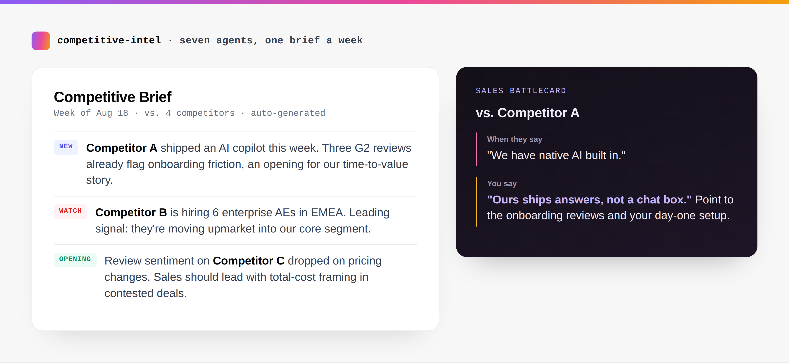

# competitive-intel

A [Claude Code](https://claude.ai/code) plugin that runs **autonomous competitive intelligence** for B2B teams. Point it at your competitors and it tracks them across LinkedIn, news, user reviews, job postings, and regulatory signals, then writes an executive brief and per-competitor sales battlecards, on a schedule, and emails them to you.



> **Noncommercial use only (PolyForm Noncommercial 1.0.0).** This plugin is the work of Brittany Slay. Use, adapt, and share it for noncommercial purposes with attribution intact. Commercial use - reselling, white-labeling, or productizing it - requires a license from Brittany Slay. See [LICENSE.md](LICENSE.md).

Every run produces a dated executive brief and one sales battlecard per competitor. The brief reads like this:

```markdown
# Competitive Intelligence Brief - Week of [date]

## Executive Summary
- [Competitor A] shipped usage-based pricing; expect it in deals by Q3.
- [Competitor B] is hiring 4 enterprise AEs in the Northeast: they're moving upmarket.
- Review sentiment on [Competitor A] dipped on onboarding complaints; a wedge for us.

## Moves this week
**[Competitor A] - new pricing page**
Signal: LinkedIn post + pricing page diff. Implication: undercuts our Team tier.
Recommended action: add a per-seat comparison to the pricing objection battlecard.

## Opportunities & threats for us
- Gap we can exploit: [Competitor B] has no SOC 2 page. Lead with trust in that segment.
```

*Battlecards are one page each: how they position, where you win, the traps, and the exact rebuttals a rep can use live.*

> **Anonymized template.** The two config files ship as `*.example.json` describing a fictional company. Copy them, drop in your own details, and the whole system re-points at your market. Your real `company_context.json` and `competitors.json` are git-ignored so they never get committed.

---

## What it does

- **Fans out to five specialist agents** - LinkedIn, news + community forums, G2/Capterra reviews, job postings, and regulatory/industry signals - each turning one public source into structured JSON.
- **Synthesizes one executive brief** with a week-over-week diff that surfaces exactly what changed since last week, framed from your company's angle.
- **Writes a sales battlecard per competitor** a rep can use live: how they position, where you win, the traps, and the rebuttals.
- **Runs on a schedule and emails the results** - a weekly full brief and a lightweight daily breaking-news check that only pings you when something scores ≥ 4/10.
- **Needs no paid scraping key** - free search by default (DuckDuckGo), with an optional Brave key for higher-quality results. The only required credential is a Gmail App Password for delivery.

---

## Install

**Prerequisites:** [Claude Code](https://claude.ai/code), Node.js, and a Gmail account with an [App Password](https://myaccount.google.com/apppasswords).

```bash
# 1. Clone
git clone <your-repo-url> && cd competitive-intel

# 2. Install the MCP server deps
cd mcp/apify && npm install && cd ../..

# 3. Create your config from the examples
cp company_context.example.json company_context.json
cp competitors.example.json competitors.json
#   ...then edit both with your real details.

# 4. Set delivery env vars (add to ~/.zshrc or ~/.bashrc)
export GMAIL_USER="you@gmail.com"
export GMAIL_APP_PASSWORD="xxxx xxxx xxxx xxxx"
# export BRAVE_API_KEY="..."   # optional, improves search quality

# 5. Register the MCP server
claude mcp add competitive-intel node "$(pwd)/mcp/apify/index.js" \
  -e GMAIL_USER=$GMAIL_USER -e GMAIL_APP_PASSWORD=$GMAIL_APP_PASSWORD

# 6. Run it
claude
> /run-intel
```

See **[GUIDE.md](GUIDE.md)** for full setup, customization, and scheduling.

---

## Example prompts

The `competitive-analysis` skill activates automatically when you ask competitor questions in plain language. Things people actually type:

- `track what my competitors are doing this week`
- `build me a competitive brief on Competitor A and Competitor B`
- `monitor Competitor A on LinkedIn and in the news`
- `write a sales battlecard against Competitor B`
- `what are my competitors hiring for right now?`
- `set up weekly competitive intel and email it to me`
- `watch competitor reviews on G2 and Capterra`
- `what is Competitor A doing in AI this quarter?`
- `any breaking news on my competitors today?`
- `where can we win against Competitor B in a live deal?`

You can also drive it explicitly:

```
/run-intel                    # Full cycle - all agents, brief, battlecards, email
/run-intel focus:product      # LinkedIn + news only - fast product check
/run-intel focus:hiring       # Hiring tracker only
/run-intel focus:regulatory   # Regulatory radar only
/run-intel no-email           # Run everything, skip email
/daily-alert                  # Manual breaking-news check
```

---

## What's inside

| File / component | What it does |
|---|---|
| `skills/competitive-analysis.md` | Auto-activates on competitor questions; orchestrates the workflow |
| `agents/linkedin-researcher.md` | Reads competitor LinkedIn posts → themes, product signals, tone |
| `agents/news-scanner.md` | News, press, blog + Reddit/forums → launches, partnerships, complaints |
| `agents/review-monitor.md` | G2, Capterra, SoftwareAdvice → sentiment trends and your openings |
| `agents/hiring-tracker.md` | Job posting analysis → leading product signals, tech stack, expansion |
| `agents/regulatory-radar.md` | Regulatory & industry signals → what's coming and competitor reactions |
| `agents/brief-writer.md` | Synthesizes all agents → executive brief with week-over-week diff |
| `agents/battlecard-writer.md` | Brief + reviews + hiring → per-competitor sales battlecards |
| `commands/run-intel.md` | `/run-intel` - full weekly pipeline |
| `commands/daily-alert.md` | `/daily-alert` - lightweight daily breaking-news check |
| `mcp/apify/index.js` | MCP server - `linkedin_posts`, `check_sitemap`, `crawl_website`, `google_search`, `send_email` |
| `scripts/weekly-run.sh` | Cron: weekly full brief |
| `scripts/daily-alert.sh` | Cron: daily breaking-news check |
| `company_context.example.json` | Copy to `company_context.json` - your positioning (git-ignored) |
| `competitors.example.json` | Copy to `competitors.json` - who to track (git-ignored) |

### Configuration

| Variable | Required | Description |
|---|---|---|
| `GMAIL_USER` | Yes | Gmail address used to send the brief |
| `GMAIL_APP_PASSWORD` | Yes | Gmail App Password - [generate here](https://myaccount.google.com/apppasswords) |
| `BRAVE_API_KEY` | No | [Brave Search API](https://brave.com/search/api) key - free tier, improves search over DuckDuckGo |

**No paid scraping key required.** Search uses DuckDuckGo by default; crawling uses native HTTP fetch; LinkedIn coverage is best-effort via search-indexed posts. Two files drive all quality - keep them current:

- **`company_context.json`** - your positioning, differentiators, win/loss themes, ICP. Injected into every brief and battlecard.
- **`competitors.json`** - who to track, plus a free-text `notes` field per competitor that gives the agents starting context.

### A note on ethics

This tool reads **publicly available** information: public posts, press, published reviews, public job listings. It does not scrape private data, bypass logins, or collect personal contact information. Keep it that way. See [PRIVACY.md](PRIVACY.md).

---

## License

Noncommercial use only (PolyForm Noncommercial 1.0.0). Commercial use requires a license from Brittany Slay. See [LICENSE.md](LICENSE.md).

---

Built by [Brittany Slay](https://brittanyslay.com), a B2B marketing leader who builds AI-native tools. More free Claude skills at [brittanyslay.com/skills](https://brittanyslay.com/skills). Want a competitive-intel program or an AI-native marketing function built for real? [Get in touch](https://brittanyslay.com/#contact).
